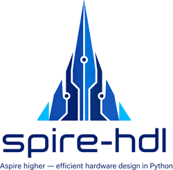

<div align="center">
  
</div>

<br>

<p align="center">
  <a href="https://github.com/huawei-csl/spire-hdl/actions/workflows/ci.yml"></a>
  <a href="https://pypi.org/project/spire-hdl/"></a>
  <a href="LICENSE"></a>
</p>

**Spire** — a modern Python HDL that compiles concise, composable hardware descriptions to synthesizable Verilog and AIG netlists, with synthesis optimization and a cycle-accurate simulator built in.

- **Built for humans and agents alike:** a small surface that stays readable as a design grows
- **Reduces area and delay vs. a traditional Verilog flow:** optimization is part of the compile
- **Integrated with ABC and mockturtle:** modern synthesis optimization wired directly into the compilation pipeline
- **Arithmetic library with automated replacement:** swap adders, multipliers, and FP cores driven by an objective
- **Cycle-accurate Python simulator"** drive inputs, tick clocks, inspect expressions/outputs without leaving Python
- **Content-addressed optimization cache:** instant re-runs via `@abc_optimized` /`@flowy_optimized` decorators

## Optimizations built in 💡

Spire supports **source-level optimization intent**: the designer marks *what* to optimize (e.g. a module, FSM, or arithmetic block) directly in the HDL source, and the compiler realizes it through synthesis-aware passes.

Because these passes run as part of the compile, the emitted Verilog is already small and fast before external tools see it. The numbers below are measured against a plain Yosys flow on the same RTL.

### 🔢 Arithmetic auto-replacement: `@arithmetic_optimized`

Drops in topology-tuned adders, multipliers, and MAC fusions against an `area` / `delay` / `adp` objective. On an 8-bit ALU (add + sub + mul):

- **−51% transistors** with the `area` objective
- **4.2× shorter critical path** with the `delay` objective
- balanced `adp` gets near-minimal area *and* near-minimal depth at once

MAC patterns (`a*b + c`) are fused into single column-reduction units, eliminating a full adder stage. See [`README_arithmetic_optimization.md`](docs/README_arithmetic_optimization.md).

### 🧩 ABC + mockturtle decorators: `@abc_optimized` / `@flowy_optimized`

One decorator stacks modern AIG synthesis (`resyn2`, `&deepsyn`, mockturtle) onto any `Component` or `Netlist`, with a content-addressed cache for instant re-runs:

- **−69% AIG gates** on an 8-bit multiplier (`resyn2`)
- **−83%** on a 16-bit multiplier
- stack with `@arithmetic_optimized` for compounding wins — ABC cleans up after the arithmetic rewriter

See [`README_optimization_decorators.md`](docs/README_optimization_decorators.md).

### 🎯 FSM + encoding search: `optimized_fsm` / `optimized_encoding`

Hopcroft state minimisation and bit-assignment search as two composable context managers. On a 7-state `case10` Moore FSM:

- **−19% cells** with `optimized_encoding` alone
- **−44% cells** with `optimized_fsm` alone
- **−69.5% cells** when both are nested — a ~3× reduction with two `with` blocks, no hand-tuned encoding tables

An 8-opcode CPU decoder sees **−66.7% cells** from a single `optimized_encoding`, because the search discovers an opcode layout where each wide OR collapses to one bit-test. See [`README_fsm_optimization.md`](docs/README_fsm_optimization.md).

### 🛠️ Fine-grained architecture selection: `arithmetic_generator`

Beyond the automatic passes above, the unified arithmetic generator lets you hand-pick the exact micro-architecture of an adder, multiplier, MAC, or matmul (partial-product generation, compression-tree topology, and final-stage adder), then emit Verilog/AIG, simulate, and collect Yosys metrics for direct comparison. See [`README_arithmetic_generator.md`](docs/README_arithmetic_generator.md).

## Overview

### 🪶 Minimal core

In its simplest form, Spire only needs these core files. This is intentional — the HDL is kept to a minimal, self-contained core, and higher-level features are layered on top:

- **[`spire/expr.py`](src/spire/expr.py)** – the expression DSL. It provides bit-precise types such as `Bool`, `UInt`, and `SInt`, shared-expression caching, and the overloaded arithmetic / bitwise operators that make the Python syntax feel like an HDL.
- **[`spire/component.py`](src/spire/component.py)** – the `Component` base class: author reusable designs, declare IO with `IORecord`/`Input`/`Output`, emit Verilog/AIG, analyze, and import/embed sub-designs. The flat netlist IR it lowers to lives in **[`spire/ir.py`](src/spire/ir.py)** (`Netlist`).
- **[`spire/simulator.py`](src/spire/simulator.py)** – a lightweight simulator that can drive inputs, tick clocks, inspect outputs or internal expressions, and capture probes for debugging—all without leaving Python.

### 📚 Further reading

Deeper guides for specific features:

- **[Type system](docs/README_type_system.md)** — values, the `BitSerializable` / `Assignable` traits, the `Expr` vs `HDLComposite` hierarchy, and the `…Like` coercion aliases (class diagram + philosophy)
- **[Composite data types](docs/README_composite_types.md)** — structured bit-packable values (`Array`, `CompositeRecord`, `FixedPoint`, `FloatingPoint`, `CompositeRegister`) with `to_bits` / `<<=` / `@=`
- **[Interfaces](docs/README_interfaces.md)** — reusable IO bundles (`Stream`, `Flow`, `MemPort`) with `Flipped` / `connect` / `view_as_flipped` and on-interface behaviour
- **[State machines](docs/README_state_machines.md)** — declaration with the `State` / `Encoding` API and `switch_` / `case_` bodies
- **[Control structures](docs/README_control_structures.md)** — `if_` / `elif_` / `else_` and `switch_` / `case_` / `default` context managers
- **[Memories](docs/README_memories.md)** — RAM / ROM / FIFO primitives, port wiring with `<<=`, simulation, and reading state
- **[Arithmetic optimization](docs/README_arithmetic_optimization.md)** — automatic replacement with optimized versions (adders, multipliers, MAC, etc)
- **[Optimization decorators](docs/README_optimization_decorators.md)** — `@abc_optimized` / `@flowy_optimized` circuit optimization
- **[FSM optimization](docs/README_fsm_optimization.md)** — `optimized_fsm` and `optimized_encoding` (state minimisation + encoding search)
- **[Arithmetic generators](docs/README_arithmetic_generator.md)** — evaluation scripts and extra tooling notes
- **[Tiled matmul accelerator](docs/README_output_stationary_matmul.md)** — parametrizable signed output-stationary matmul over a `T×T×T` core, with input/output RAMs and a `mode` + RAM-access interface
- **[Custom Verilog](docs/README_custom_verilog.md)** — emit a raw Verilog block from a `CustomVerilogComponent`, with or without a Python sim model (blackbox)
- **[AIG / AAG export & import](docs/README_aig_export.md)** — lower a `Component` to an AIGER netlist and read AIG/AAG back in as a `Component`
- **[Verilog testbench](docs/README_verilog_testbench.md)** — turn a `Simulator` run into a self-checking, synthesizable Verilog testbench
- **[Examples](testing/examples/README.md)** — example designs exercising Spire features

## Installation

Install the latest release from PyPI:

```bash
pip install spire-hdl
```

For development, install from source in editable mode:

```bash
git clone https://github.com/huawei-csl/spire-hdl.git
cd spire-hdl
pip install -e .
```

The library relies on the packages listed in `requirements.txt`.

## Quick start

### 1. Describe a component

A `Component` is the one abstraction you author. Declare its IO once with `IORecord`
(field names become signal names; `Input`/`Output` set direction), put the logic in
`elaborate()`, and emit Verilog directly — without ever touching the IR:

```python
from spire import Component, IORecord, Input, Output, Bool, UInt
from spire.expr import mux, cat

class LogicDemo(Component):
    def __init__(self):
        self.io = IORecord(
            a=Input(UInt(8)),
            b=Input(UInt(8)),
            sel=Input(Bool()),
            sum=Output(UInt(9)),
            mask=Output(UInt(4)),
            out=Output(UInt(8)),
        )
        self.elaborate()

    def elaborate(self):
        io = self.io
        io.sum <<= io.a + io.b                        # automatic width growth
        io.mask <<= cat(io.a[7], io.b[7])             # concatenate slices
        io.out <<= mux(io.sel, io.a & io.b, io.a | io.b)

demo = LogicDemo()
print(demo.to_verilog(name="LogicDemo"))
```

`to_verilog()` checks that every output has a driver (and every register a next-state assignment) before emitting Verilog (see [`component.py`](src/spire/component.py)).

**Registers** are created via the standalone `Register` class, which takes a `typ` and an optional reset value via the `init=` keyword (note: the keyword is `init`, not `reset_value` / `reset`). Assign the next-state expression with `<<=`, and pass `with_clock`/`with_reset` when emitting a sequential component:

```python
from spire import Component, IORecord, Output
from spire.expr import Register, UInt

class Counter(Component):
    def __init__(self):
        self.io = IORecord(q=Output(UInt(8)))
        self.elaborate()

    def elaborate(self):
        cnt = Register(UInt(8), init=0)   # reset value via init=
        cnt <<= cnt + 1                   # next-state = cnt + 1
        self.io.q <<= cnt

print(Counter().to_verilog(name="Counter", with_clock=True, with_reset=True))
```

### 2. Simulate the design

```python
from spire import Simulator

sim = Simulator(demo)       # Simulator lowers the Component internally
sim.set("a", 0xC3)
sim.set("b", 0x99)
sim.set("sel", 1)
sim.eval()                  # recompute combinational logic
print(sim.peek_outputs())   # {'sum': 0x15c, 'mask': 0x3, 'out': 0x81}
```

The simulator keeps track of inputs, wires, outputs, and registers, supports `eval()` for combinational updates, `step()` for clocked designs, and exposes helpers such as `peek`, `peek_next`, and signal watching for deeper inspection ([`simulator.py`](src/spire/simulator.py)).

### 3. Export, import & equivalence-check

A `Component` converts to Verilog, AIGER, or the flat netlist IR — and re-imports the same formats — so you can hand a design to synthesis, optimize it externally, and check the result is still equivalent:

```python
from spire import Component
from spire.aig.aig_aigerverse import conv_aag_into_aig
from aigverse import Aig, equivalence_checking

verilog = demo.to_verilog(name="LogicDemo")   # synthesizable Verilog (str)
aag     = demo.to_aag(name="LogicDemo")        # AIGER ASCII lines (list[str])
net     = demo.to_netlist(name="LogicDemo")    # flat netlist IR (Netlist)

demo2 = Component.from_netlist(net)            # re-import the IR (also: .from_verilog / .from_aag_lines)

# equivalence-check the original against the re-imported design (aigverse, on their AIGs)
a1 = conv_aag_into_aig(demo.to_aag(name="LogicDemo"), Aig())
a2 = conv_aag_into_aig(demo2.to_aag(name="LogicDemo"), Aig())
assert equivalence_checking(a1, a2)
```

## Components and the netlist IR

- `Component` is the one abstraction you author. It builds Verilog/AIG directly (`to_verilog`, `to_aag`), analyzes timing (`analyze`), imports designs from Verilog or AIG formats (`from_verilog`, `from_aag_lines`, `from_netlist`), and embeds reusable sub-designs into the surrounding logic automatically when their IO is wired. Components expose `get_ios()` / `get_spec()` as the single IO normalization point — also what drives port regrouping when you import flattened designs (see [`component.py`](src/spire/component.py)).
- `Netlist` (in [`spire.ir`](src/spire/ir.py)) is the flat, lowered netlist that every backend consumes — Spire's internal IR. Power users can build one directly: it offers constructors for inputs, outputs, wires, and registers; signal enumeration; Verilog emission with automatic width fitting; and an `analyze()` routine reporting combinational depth and node counts. The quick start never needs it.
- Minimal end-to-end component example: [`testing/examples/simple_component.py`](testing/examples/simple_component.py).

Short component + hierarchy usage example:

```python
from spire import Component, IORecord, Input, Output, UInt

class SimpleAdder(Component):
    def __init__(self, width=8):
        self.width = width
        self.io = IORecord(
            a=Input(UInt(width)),
            b=Input(UInt(width)),
            sum=Output(UInt(width + 1)),
        )
        self.elaborate()

    def elaborate(self):
        self.io.sum <<= self.io.a + self.io.b

class Sum3Hierarchical(Component):
    def __init__(self):
        self.io = IORecord(
            a=Input(UInt(8)),
            b=Input(UInt(8)),
            c=Input(UInt(8)),
            sum=Output(UInt(10)),
        )
        self.elaborate()

    def elaborate(self):
        add_ab = SimpleAdder(width=8)     # first sub-component
        add_abc = SimpleAdder(width=9)    # second sub-component
        add_ab.io.a <<= self.io.a
        add_ab.io.b <<= self.io.b
        add_abc.io.a <<= add_ab.io.sum
        add_abc.io.b <<= self.io.c
        self.io.sum <<= add_abc.io.sum

print(Sum3Hierarchical().to_verilog(name="Sum3Hier"))  # one flat module, built from embedded components
```

### Hierarchical design with components

Components are how to build hierarchy: instantiate one inside another, adapt its IO, or drop in a pre-synthesized netlist — all without leaving Python. A common pattern wraps a reusable Spire block (see [`multipliers_ext.py`](src/spire/arithmetic/int_multipliers/multipliers/multipliers_ext.py)). It is also possible to import an external AIG module, turn it into a `Component`, and use it directly as a native Spire block inside a larger generator (see [`multipliers_ext_optimized.py`](src/spire/arithmetic/int_multipliers/multipliers/multipliers_ext_optimized.py)). The same approach covers Verilog imports, so Spire code and external IP mix freely.

## Composite data types

Spire includes structured, bit-packable composites for cleaner interfaces and bulk assignments ([`composite/`](src/spire/composite)). See [`README_composite_types.md`](docs/README_composite_types.md) for the full reference with an example for every type:

- `HDLComposite` defines the base "pack to bits" API that powers all composites ([`base.py`](src/spire/composite/base.py)).
- `Array` offers N-dimensional indexing, packed assignment (`<<=`), and element-wise assignment (`@=`) for nested vectors or composites ([`array.py`](src/spire/composite/array.py)).
- `CompositeRecord` is the bundle of named fields that stays packable to a flat bitvector — build it inline (`CompositeRecord(a=Input(...), ...)`), via a subclass `__init__` calling `super().__init__(...)`, or as a `@dataclass`; declare fields as annotations for IDE autocomplete ([`record.py`](src/spire/composite/record.py)).
- `FixedPoint` wraps a `Wire` or view with explicit total/frac widths and quantization helpers, keeping arithmetic readable while staying hardware-friendly ([`fixed_point.py`](src/spire/composite/fixed_point.py)).
- `FloatingPoint` provides an IEEE-style view with `add`/`mul` helpers parameterized by exponent / fraction widths ([`floating_point.py`](src/spire/composite/floating_point.py)).
- `CompositeRegister` stores any composite in a single register while preserving a structured view via `.value`/`.Q` ([`register.py`](src/spire/composite/register.py)).

Example:

```python
from spire.composite.array import Array
from spire.composite.record import CompositeRecord
from spire.composite.fixed_point import FixedPoint, FixedPointType
from spire.composite.register import CompositeRegister
from spire.expr import UInt, Wire

class Bus(CompositeRecord):
    data = Wire(UInt(8))
    valid = Wire(UInt(1))

payload = Array([Bus(), Bus()])
acc = FixedPoint(FixedPointType(width_total=16, width_frac=8))
acc_reg = CompositeRegister(FixedPoint, acc.ftype, name="acc_reg")

acc_reg <<= acc            # packed register write
payload[1] @= payload[0]   # element-wise copy between bundles
```

## Simulation notes

The simulator supports both combinational and sequential designs:

- `eval()` recomputes combinational logic and captures registered probes.
- `set()` and `get()` let you drive or inspect signals by name.
- `step()` advances the clock, committing register next-state expressions while honoring asynchronous resets.
- `watch()` and `peek_next()` provide scope-style visibility for debugging complex pipelines.

For waveforms, set `sim.trace_enabled = True` before driving the design, then dump the captured trace to a VCD file:

```python
from spire.various.vcd_writer import write_vcd

sim.trace_enabled = True
sim.eval()
for _ in range(5):
    sim.step()
write_vcd(trace_by_names=sim.get_trace_by_names(), filename="run.vcd", top_module=m.name, timescale="1ns")
```

## Slices
Spire signals follow Python's indexing convention. For example, `sig[4:7]` creates a new expression made up of bits 4, 5, and 6 (counted from the LSB) of the original expression `sig`.

## Examples

Check out the `testing/examples/` directory for practical examples:

- **[`simple_component.py`](testing/examples/simple_component.py)** – A minimal example showing how to define a Component with IO ports and generate Verilog
- **[`component_example.py`](testing/examples/component_example.py)** – Comprehensive examples including hierarchical design and simulation
- **[`composing_components.py`](testing/examples/composing_components.py)** – Shows how to compose a larger `Component` from smaller automatically embedded components
- **[`direct_expression_basics.py`](testing/examples/direct_expression_basics.py)** – Minimal direct expression examples (`y = a + b`) plus `+`, `-`, unary `-`, `Const(..., Int(...))`, typed/plain `False`, and a recursive Horner polynomial builder
- **[`testing/riscv/rv32i.py`](testing/riscv/rv32i.py)** – Minimal RV32I core example; see [`testing/riscv/test_rv32i.py`](testing/riscv/test_rv32i.py) for simulation-based checks.

See the [examples README](testing/examples/README.md) for detailed documentation and key concepts.
