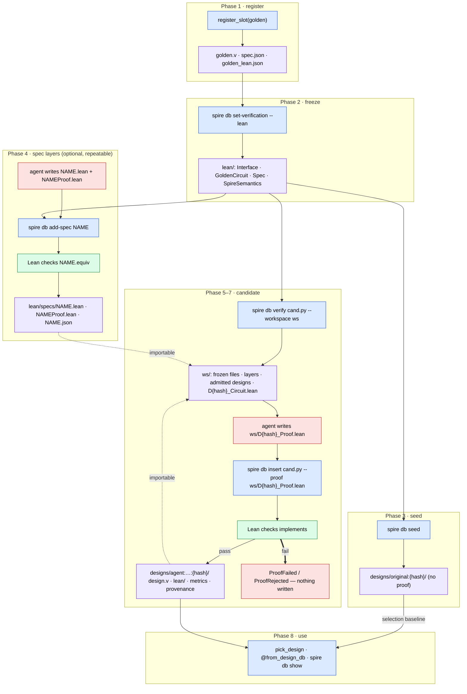

# Lean-gated slots: the flow, phase by phase

A design_db slot can use a kernel-checked Lean 4 proof as its admission oracle instead of CEC or
simulation. This page walks the whole lifecycle: which command runs, who produces what, which files
appear where, and what is checked at each step. Background and rationale: `README_design_db.md`
("Lean tier").

Actors: **Spire** (the package, deterministic), **agent/human** (writes proofs and spec layers),
**Lean** (`lake build` + kernel, the only judge).

## The whole flow



Seeding puts the golden into the pool selection draws from (the floor: `pick_design` can never do worse
than the original). It is not a proof base: a delta proof against the golden imports the frozen
`GoldenCircuit.lean` directly, and `Spec.Correct GoldenCircuit.eval` holds by definition.

Blue is generated by Spire, red is authored, green is checked by Lean, purple is what lands on disk.
`D{hash}_Circuit` / `D{hash}_Proof` name a **d**esign's Lean modules: `{hash}` is the first ten hex characters of its structural hash,
e.g. `D97a95c77dc_Proof.lean`. The `D` prefix is needed because a Lean module name must start with a letter
and a hash may start with a digit; it also keeps design modules visibly apart from the frozen files and the
spec layers in a workspace.
Red enters the gate at exactly two points: a spec layer (step 4) and a candidate proof (step 6). Both
are checked by Lean before anything is stored.

## Phase 1 — register the slot

```python
key = register_slot(golden_component, name="mmac")        # Python only; the decorator does this too
```

| | |
|---|---|
| Who | Spire |
| Generates | `spec.json` (ports, class, key), `golden.v`, default `verification.json` (cec), **`golden_lean.json`**: the golden's netlist translated to Lean plus its arithmetic shapes |
| Checks | the golden is translatable (combinational; signed `+`, `*`, resize; no `custom_verilog`). If not, `golden_lean.json` is absent and the slot cannot be Lean-gated — everything else still works |
| Cost | milliseconds, no Lean |

## Phase 2 — freeze the Lean oracle

```bash
spire db set-verification --slot mmac --lean [--author A] [--budget S] [--check] [--workspace DIR]
```

| | |
|---|---|
| Who | Spire. No spec file, no proof, no author needed |
| Generates (write-once, read-only) | `lean/Interface.lean` — `Inputs`/`Outputs` from the ports · `lean/GoldenCircuit.lean` — from `golden_lean.json` · `lean/Spec.lean` — `def Spec.Correct e := ∀ i, e i = GoldenCircuit.eval i` · `lean/SpireSemantics.lean` — pinned copy · `lean/specs/` — empty · `verification.json` — `method: lean, tier: 3`, hashes of the four files, toolchain |
| Checks | the four files compile (`lake build Spec`) |
| Options | `--check`: run the check, freeze nothing. `--workspace DIR`: keep the Lean project. |
| Fails when | `golden_lean.json` is missing, or the slot already has a frozen oracle (immutable) |

`Spec.Correct` is the statement every later proof must end with. It never changes.

## Phase 3 — seed the golden

```bash
spire db seed --slot mmac
```

| | |
|---|---|
| Who | Spire |
| Generates | `designs/original:<hash>/` with `design.v`, metrics, provenance (`proof: "golden (Spec is its definition)"`) and `lean/build.log` |
| Checks | none needed: the golden satisfies its own equivalence by definition |
| Role | selection baseline only. Proofs never import it — they import the frozen `GoldenCircuit.lean` |

## Phase 4 — add a spec layer (optional, repeatable)

```bash
spire db add-spec --slot mmac Mmac Mmac.lean MmacProof.lean [--author agent:lean-spec-author] [--check] [--workspace DIR]
spire db add-spec --slot mmac Dot  Dot.lean  DotProof.lean            # a second layer, later
```

| | |
|---|---|
| Who | agent or human writes both files |
| `Mmac.lean` | `def Mmac.Correct (eval : Inputs → Outputs) : Prop := …` — the nicer statement, e.g. `Y = C + A·B` over the integers |
| `MmacProof.lean` | `theorem Mmac.equiv (e) : Mmac.Correct e ↔ Spec.Correct e`. May import earlier layers: `Dot.equiv := (Dot.via_Mmac e).trans (Mmac.equiv e)` |
| Checks | name is a fresh capitalised identifier, not reserved (`Spec`, `Interface`, `GoldenCircuit`, `SpireSemantics`, `*Proof`, `D*_`) · `lake build NAMEProof` against the frozen files + existing layers + admitted designs · `NAME.equiv` has exactly the type `∀ e, NAME.Correct e ↔ Spec.Correct e` · axioms: Lean's three base axioms and `bv_decide` certificates only (judged by type, never by name; `sorry` and custom axioms rejected) |
| Generates (append-only, read-only) | `lean/specs/Mmac.lean`, `lean/specs/MmacProof.lean`, `lean/specs/Mmac.json` (author, statement, axioms, imports) |
| Fails with | `SpecRejected` (Lean log attached); `DesignDBError` for names. Nothing written |
| Effect on existing designs | none — their proofs target `Spec.Correct`, which did not change |

A layer is an investment: once `Mmac.equiv` exists, a candidate proof can prove the integer statement
and convert, instead of proving bit-level equality to the golden.

## Phase 5 — get the candidate's workspace

```bash
spire db verify --slot mmac cand.py --workspace ws        # no --proof: exit 2 on purpose
```

| | |
|---|---|
| Who | Spire |
| Checks first | `cand.py` is spire-native (`build()` → Component), ports match the slot, translatable |
| Generates in `ws/` | the four frozen files · every layer (`Mmac.lean`, `MmacProof.lean`, …) · every admitted design's `D<h>_Circuit.lean` + `D<h>_Proof.lean` · **`D<hash>_Circuit.lean`** for this candidate (`hash` = its structural hash) · `lakefile.lean`, `lean-toolchain` |
| Output | `FAIL: no proof given; workspace written to ws — write D<hash>_Proof.lean with theorem implements : Spec.Correct D<hash>_Circuit.eval (layers: Mmac, Dot)` |
| Does not generate | any proof |

## Phase 6 — the agent writes the proof

Only `ws/D<hash>_Proof.lean` is meant to be written. Everything else in `ws/` is regenerated by the gate, so
editing it changes nothing. Three shapes that all end in the same statement:

```lean
-- (a) direct: bit-level equality with the golden (rarely convenient)
theorem implements : Spec.Correct Da_Circuit.eval := by ...

-- (b) through a layer: prove the integer statement, convert with equiv
import Da_Circuit
import MmacProof
namespace Da_Proof
@[simp] theorem add_17_16_18_exact ... := by ... bv_decide ...     -- one per arithmetic shape
theorem implements : Spec.Correct Da_Circuit.eval :=
  (Mmac.equiv _).mp (by intro i; and_intros <;> (simp [Da_Circuit.eval]; ac_rfl))
end Da_Proof

-- (c) delta: the design differs from admitted design b by one local rewrite
import Da_Circuit
import Db_Circuit
import Db_Proof
namespace Da_Proof
theorem step (i : Inputs) : Da_Circuit.eval i = Db_Circuit.eval i := by
  simp only [Da_Circuit.eval, Db_Circuit.eval, mulSS, BitVec.mul_comm]
theorem implements : Spec.Correct Da_Circuit.eval := fun i => (step i).trans (Db_Proof.implements i)
end Da_Proof
```

Iterate with `cd ws && lake build` and read Lean's errors. Rules the checker will enforce: keep the
statement; no `sorry`; no `axiom`; `bv_decide` only inside small lemmas about one arithmetic node.

## Phase 7 — verify, then insert

```bash
spire db verify --slot mmac cand.py --proof ws/D<hash>_Proof.lean            # advisory, writes nothing
spire db insert --slot mmac cand.py --proof ws/D<hash>_Proof.lean --source agent:rtl-lean-proof
```

| | |
|---|---|
| Who | Spire runs the gate; Lean judges |
| Checks, in order | spire-native · ports · **structural hash: an already admitted structure is a rediscovery, no proof needed** · `D<hash>_Circuit.lean` regenerated from the netlist (the submitter's copy is ignored) · `lake build D<hash>_Proof` with frozen files, layers, admitted designs · `implements` has exactly type `Spec.Correct D<hash>_Circuit.eval` · axiom audit, **transitive** through every import (layers and earlier designs included) |
| Generates on pass | `designs/agent:rtl-lean-proof:<hash>/`: `design.v`, `design.py`, `metrics.json`, `provenance.json` (`verification.proof`, `verification.depends_on` = the proof's imports), `lean/D<hash>_Circuit.lean`, `lean/D<hash>_Proof.lean`, `lean/axioms.json`, `lean/build.log` — one atomic directory move |
| Fails with | `ProofFailed` (does not build; log) · `ProofRejected` (weakened statement, `sorry`, disallowed axiom) · `VerificationFailed` (not spire-native, no proof, custom Verilog, untranslatable). Nothing written |

Why a proof through layers and deltas still proves the spec: `implements` imports `Mmac.equiv` or
`Db_Proof.implements`, so the kernel re-checks the whole chain when it checks `implements`, and the axiom
audit walks the same chain. A third layer proven via the second, or a design proven by delta to a design
proven by delta, is exactly as trustworthy as its pieces — and never more trusted for having been admitted
earlier.

## Phase 8 — use the slot

`pick_design`, `@from_design_db`, `spire db show`, `ls`, `annotate`: unchanged. `show` prints the oracle
and, per design, its axioms and `depends_on`.

## What lives where, at the end

```text
slots/<key>/
  spec.json  golden.v  golden_lean.json  verification.json            (registration + freeze)
  lean/SpireSemantics.lean  Interface.lean  GoldenCircuit.lean  Spec.lean   write-once, read-only
  lean/specs/Mmac.lean  MmacProof.lean  Mmac.json                          append-only, read-only
  lean/specs/Dot.lean   DotProof.lean   Dot.json
  designs/original:4f5cb091bf/    design.v  metrics.json  provenance.json  lean/build.log
  designs/agent:…:97a95c77dc/     …  lean/D97a95c77dc_Circuit.lean  D97a95c77dc_Proof.lean  axioms.json  build.log
  designs/agent:…:fd13e372ff/     …  lean/Dfd13e372ff_Circuit.lean  Dfd13e372ff_Proof.lean  (imports D97a95c77dc_Proof)
```

## Same flow as the simulation tier

| Stage | Simulation | Lean |
|---|---|---|
| freeze | `--auto` or `--stimulus F`; golden simulated once | `--lean`; nothing authored, nothing proven |
| refine oracle | – | `add-spec` (append-only) |
| seed | golden re-simulated | golden admitted by definition |
| candidate inputs | `.py`, `.v`, Verilog text | `.py` / Component only, plus `--proof` |
| dry run / workspace | `--check` | `--check`; `--workspace DIR` |
| gate | Verilator, exact trace match | `lake build` + statement + transitive axiom audit |

Requirements: `lake` on PATH (`elan` with `leanprover/lean4:v4.33.1`); its absence is an error, never a
silent pass. Combinational slots only.
