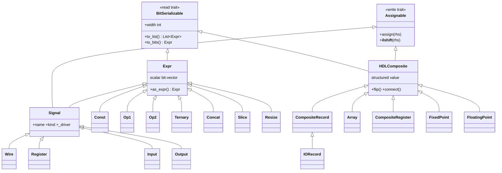

# Type System — Values, Traits & Class Hierarchy

A quick map of the value types in Spire and the philosophy behind them. For the per-type
reference (Array, FixedPoint, records, …) see [`README_composite_types.md`](README_composite_types.md).

## Philosophy in one minute

Spire splits "what an HDL value can do" into **two orthogonal capability traits**, so the type
of a value tells you exactly how it may be used:

- **`BitSerializable`** — the *read* side. "I can be flattened to an ordered list of bit leaves."
  Everything that carries bits is `BitSerializable`.
- **`Assignable`** — the *write* side. "I can be the target of `<<=` (driven)." An l-value.
  A `Const` or `a + b` is a value but **not** assignable; a `Signal` is.

Orthogonal to *capability* is *shape*. A value is either:

- **scalar** — a single bit-vector node: `Expr` (and its named l-value `Signal`), or
- **structured** — a tree of named fields/elements: `HDLComposite` (records, arrays, …).

Both shapes are `BitSerializable`, so anything can be viewed as a flat bit-vector via `to_bits()`.
Only `Signal` and `HDLComposite` are `Assignable`.

A separate descriptor, **`HDLType`**, says *how many bits* and *how to interpret them*
(`width`, `signed`, `is_bool`) — it is metadata on a value, not a value itself.

Direction (`input`/`output`/`wire`/`reg`) is **not** a type — it lives in `Signal.kind`, and
composites reverse it with `flip()` / `view_as_flipped()`. This keeps the type lattice small.

## Class diagram



(`Signal` and `HDLComposite` inherit from **both** a read trait and the write trait — they are the
only assignable things.)

## The traits (`spire/hdl_traits.py`)

| Trait | Side | Subclasses supply | Derived for free |
|---|---|---|---|
| `BitSerializable` | read | `to_list()` → ordered `Expr` leaves | `width`, `to_bits()` |
| `Assignable` | write | `assign(rhs)` | `__ilshift__` (`<<=`) |

`to_list()` is the single read primitive — a leaf returns `[self]`, a composite recurses — so
`width` and `to_bits()` (pack leaves into one `Concat`) are defined once on the trait.

## The two value families

**`Expr` (`spire/expr.py`)** — a scalar bit-vector node; `to_list()` is `[self]`. Carries the
operators (`+ & | ^ == < << …`, slicing). Computed nodes (`Const`, `Op1/Op2`, `Ternary`, `Concat`,
`Slice`, `Resize`) are values only. **`Signal`** adds `Assignable` + a `name`, a `kind`, and a
`_driver`; its subclasses are `Wire`, `Register`, `Input`, `Output`.

**`HDLComposite` (`spire/composite/base.py`)** — a structured value built from `to_list_first_level()`
(its bit-serializable children). Supports packed assignment (`<<=`, flatten-and-slice), element-wise
assignment (`@=`), and interface ops (`flip()`, `view_as_flipped()`, `connect()`). Subclasses:
`CompositeRecord` (→ `IORecord`), `Array`, `CompositeRegister`, `FixedPoint`, `FloatingPoint`.

## Type aliases — the `…Like` convention

`XLike` means "an `X`, or a Python literal coercible to one":

| Alias | Definition | Used for |
|---|---|---|
| `ExprLike` | `Union[Expr, int, bool]` | operator operands, `as_expr()` — scalar coercion |
| `BitSerializableLike` | `Union[BitSerializable, int, bool]` | assignment RHS (`assign` / `<<=`) — also allows composites |
| `Connectable` | `Union[HDLComposite, _FlippedView]` | `connect()` operands |

Since `Expr ⊆ BitSerializable`, `BitSerializableLike` is just `ExprLike` widened to also accept a
composite RHS. (`Array` exposes the same two as the domain names `ArrayElem` / `InputElem`.)

## Coercion — narrow at the edges, pack only at assignment

```
ExprLike            ──as_expr()──►  Expr        (literal→Const, Expr→shared; rejects composites)
BitSerializable     ──to_bits()──►  Expr        (pack leaves into one Concat; leaf = identity)
Expr, HDLType       ──fit_width()─►  Expr        (resize / sign-extend / truncate)
```

`as_expr()` stays deliberately **scalar** — it rejects composites so `a + bundle` is a clear error,
not a silent packing. Composites are flattened to bits **only at the assignment boundary**:

```
signal <<= rhs            # rhs: BitSerializableLike
   └─ if BitSerializable: rhs = rhs.to_bits()   # composite packed to one Expr (leaf Expr unchanged)
   └─ fit_width(as_expr(rhs), signal.typ)        # then scalar coercion + width fit
```

## Rules of thumb

- Need a **value**? It's an `Expr` (or `int`/`bool` literal).
- Need something you can **drive** (`<<=`)? It's a `Signal` or an `HDLComposite`.
- Need **bits** out of anything? `to_bits()` / `width` (from `BitSerializable`).
- Building a **scalar expression** API? Take `ExprLike`. Building an **assignment** target's RHS?
  Take `BitSerializableLike`.
- Want a **bundle/interface**? Subclass `CompositeRecord` (or use `IORecord` for a Component's IO).
